## Part 1. Установка ОС

- Установлена Ubuntu 20.04 Server LTS без графического интерфейса в VirtualBox.
- Команда для проверки версии Ubuntu:

  ```bash
  cat /etc/issue
  ```

- Скриншот: вывод команды `cat /etc/issue`:
    
    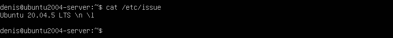

## Part 2. Создание пользователя

- Создан новый пользователь `odessabu` (отличный от пользователя, созданного при установке):

  ```bash
  sudo adduser odessabu
  ```
- Скриншот: создание нового пользователя:
    
    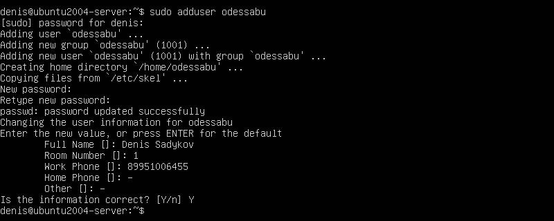

- Пользователь добавлен в группу adm:
  ```bash
  sudo usermod -aG adm odessabu
  ```
- Скриншот: Пользователь добавлен в группу adm:


- Проверка наличия пользователя в /etc/passwd:
    ```bash
    cat /etc/passwd
    ```
- Скриншот: Проверка наличия пользователя в /etc/passwd:
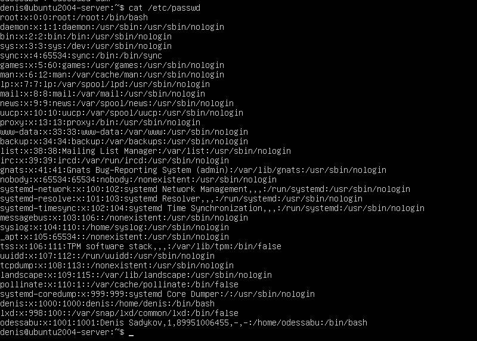

## Part 3. Настройка сети ОС

- Задано имя машины вида user-1:
    ```bash
    sudo hostnamectl set-hostname user-1
    cat /etc/hostname
    ```
- Скриншот: создание нового пользователя:
    
    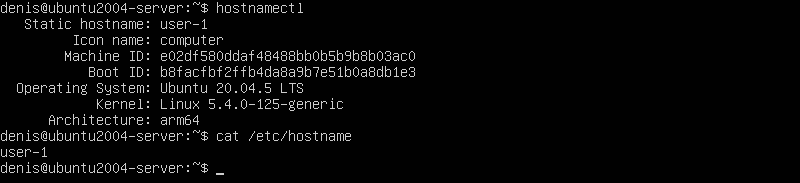

- Установлена временная зона, соответствующая текущему местоположению:
    ```bash
    sudo timedatectl set-timezone Europe/Moscow
    timedatectl
    ```

- Скриншот: вывод timedatectl (Time zone):
    
    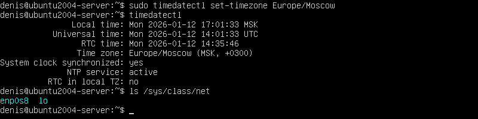
- Выведены названия сетевых интерфейсов:
    ```bash
    ls /sys/class/net
    ```
- Объяснение интерфейса lo: lo (loopback) — локальный интерфейс 127.0.0.1, используется для связи программ внутри одной машины без выхода во внешнюю сеть.

- Скриншот: список интерфейсов (включая lo):
    
    

- Получен IP-адрес устройства от DHCP-сервера (динамическая выдача):
    ```bash
    ip -4 addr
    ```

- Расшифровка DHCP: Dynamic Host Configuration Protocol — протокол автоматической выдачи сетевых параметров (IP-адрес, маска/префикс, шлюз по умолчанию, DNS).

- Скриншот: IP, полученный по DHCP (ip -4 addr):
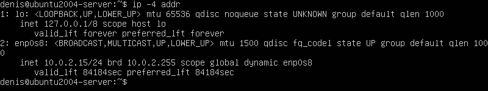

- Определены внешний IP-адрес и внутренний IP-адрес шлюза (gateway, gw):
    ```bash
    ip route | awk '/default/ {print $3}'
    curl -s ifconfig.me; echo
    ```

- Скриншот: gateway (gw) и внешний IP:
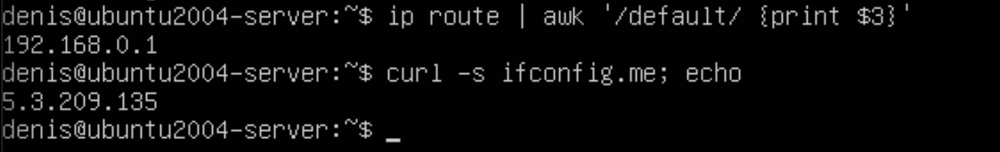

- Заданы статические настройки сети (ip/gw/dns) вручную через netplan, DNS — публичные (1.1.1.1 и 8.8.8.8):
    ```bash
    sudo netplan generate
    sudo netplan apply
    ip -4 addr show enp0s8
    ip route | grep default
    ```

- Скриншот: применение netplan и проверка статических IP и gateway:
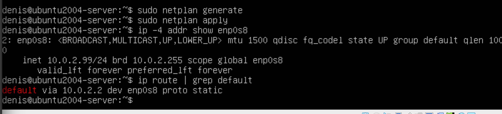

- Проверка DNS после настройки:
    ```bash
    resolvectl status | sed -n '1,120p'
    ```

- Скриншот: DNS-серверы (1.1.1.1 и 8.8.8.8):
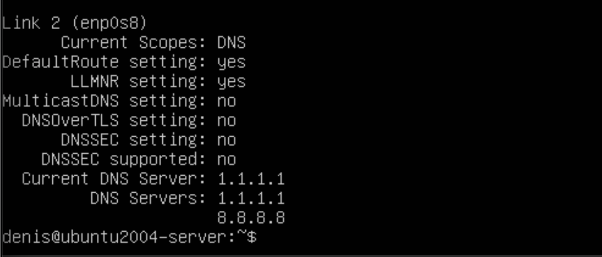

- После перезагрузки проверено, что статические настройки применились:
    ```bash
    ip -4 addr show enp0s8
    ip route | grep default
    ```
- Скриншот: IP и default gateway после перезагрузки:
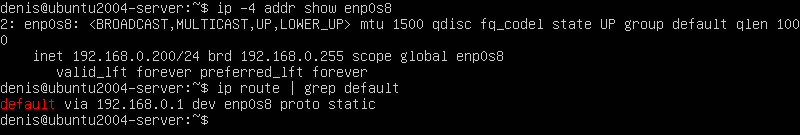

- Проверка доступности удалённого хоста по IP и доменому имени (должно быть 0% packet loss):
    ```bash
    ping -c 4 1.1.1.1
    ping -c 4 ya.ru
    ```

- Скриншот: ping 1.1.1.1 и ya.ru (0% packet loss):
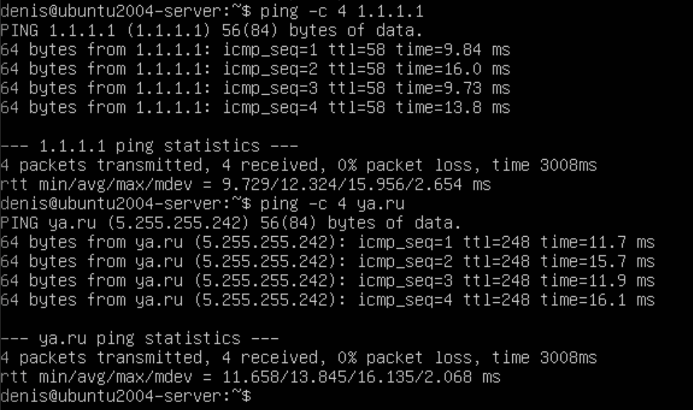

## Part 4. Обновление ОС

- Обновлены списки пакетов и установлены все доступные обновления:

  ```bash
  sudo apt update
  sudo apt upgrade -y
  sudo apt full-upgrade -y
  sudo apt autoremove -y
  ```

- Повторная проверка (обновлений нет):
    ```bash
    sudo apt upgrade
    ```

- Скриншот: сообщение об отсутствии обновлений:
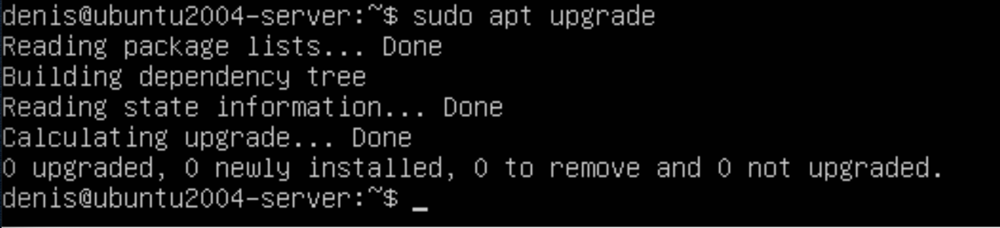

## Part 5. Использование команды sudo

- Назначение `sudo`: `sudo` (superuser do) позволяет временно выполнять отдельные команды с повышенными привилегиями (обычно root) по правилам `/etc/sudoers`. Это безопаснее, чем работа под root постоянно: права выдаются точечно и действия логируются.

- Пользователю из Part 2 (`odessabu`) разрешено использовать sudo:

  ```bash
  sudo usermod -aG sudo odessabu
  ```

- Hostname изменён от имени пользователя odessabu с использованием sudo:
    ```bash
    su - odessabu
    whoami
    sudo hostnamectl set-hostname odessabu-host
    cat /etc/hostname
    ```

- Скриншот: изменённый hostname (выполнено от пользователя Part 2 через sudo):
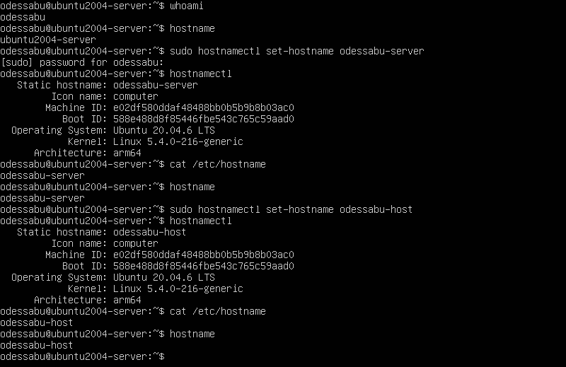

## Part 6. Установка и настройка службы времени

- Включена автоматическая синхронизация времени (NTP):

  ```bash
  sudo timedatectl set-ntp true
  ```

- Выведен текущий часовой пояс:
    ```bash
    timedatectl
    ```

- Скриншот: часовой пояс и текущее время:
    
    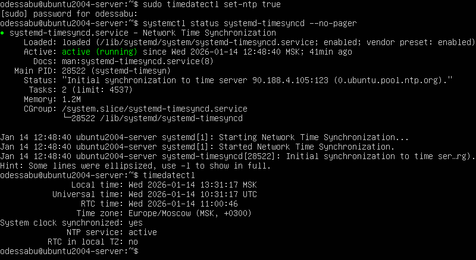

- Проверено, что синхронизация времени активна (NTPSynchronized=yes):
    ```bash
    timedatectl show | grep -E 'Timezone=|NTPSynchronized='
    ```

- Скриншот: NTPSynchronized=yes:
    
    

## Part 7. Текстовые редакторы

- Установлены текстовые редакторы: `vim`, `nano`, `mcedit`.

- Создание файлов в каждом редакторе с сохранением изменений:
  - В `vim` создан файл `test_vim.txt`, в файл записан никнейм, выход выполнен с сохранением: `Esc` → `:wq` → `Enter`.
  - В `nano` создан файл `test_nano.txt`, в файл записан никнейм, выход выполнен с сохранением: `Ctrl+O` → `Enter`, затем `Ctrl+X`.
  - В `mcedit` создан файл `test_mcedit.txt`, в файл записан никнейм, выход выполнен с сохранением: `F2` (Save), затем `F10` (Exit).

- Скриншоты: содержимое файла перед закрытием (с сохранением изменений):
    - VIM:
        
        
    - NANO:
        
        
    - MCEDIT:
        
        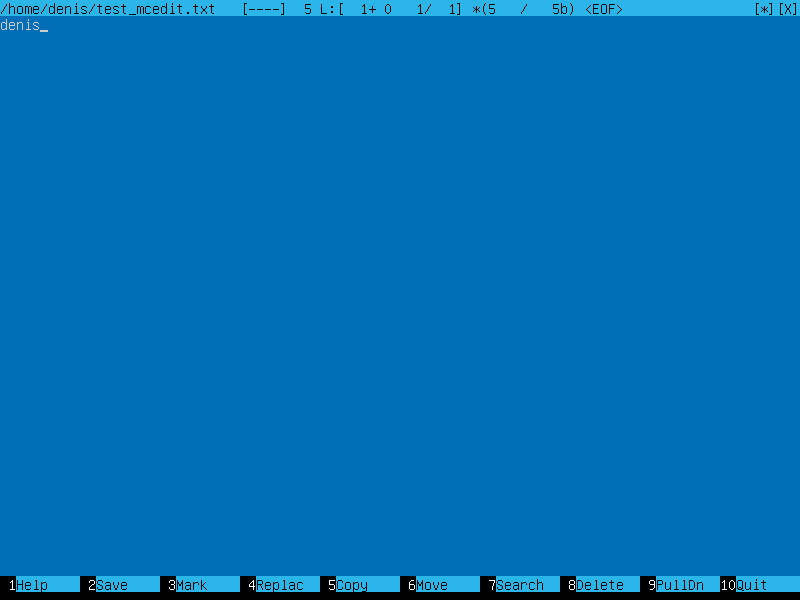

- Редактирование файлов без сохранения изменений:
  - В каждом редакторе файл открыт повторно, никнейм заменён на строку `21 School 21`.
  - Выход без сохранения:
    - `vim`: `Esc` → `:q!` → `Enter`.
    - `nano`: `Ctrl+X`, затем `N` (не сохранять).
    - `mcedit`: `F10`, затем выбрать `No`.

- Скриншоты: содержимое файла после редактирования (перед выходом без сохранения):
    - VIM:
        
        
    - NANO:
        
        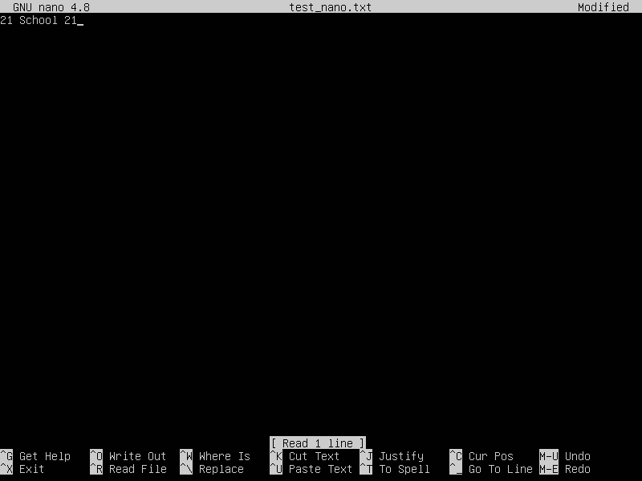
    - MCEDIT:
        
        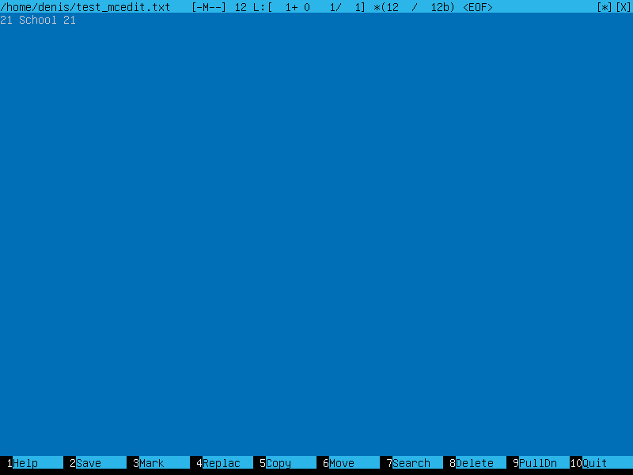

- Поиск и замена слова в каждом редакторе:
  - `vim`:
    - Поиск: `/School` (Enter), переход по совпадениям: `n`.
    - Замена во всём файле: `:%s/School/Campus/g`.
  - `nano`:
    - Поиск: `Ctrl+W`, ввести `School`, `Enter`.
    - Замена: `Ctrl+\\`, Search=`School`, Replace=`Campus`, затем `A` (Replace All).
  - `mcedit`:
    - Поиск: `F7`, ввести `School`, `Enter`.
    - Замена: `F4`, Search=`School`, Replace=`Campus`, подтвердить Replace/Replace All.

- Скриншоты: результаты поиска и замены:
    - VIM (поиск):
        
        
    - VIM (замена):
        
        
    - NANO (поиск):
        
        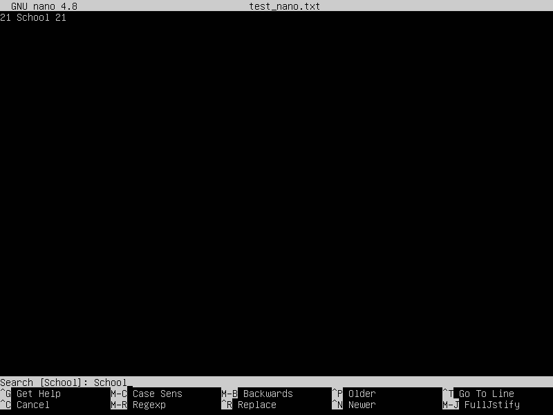
    - NANO (замена):
        
        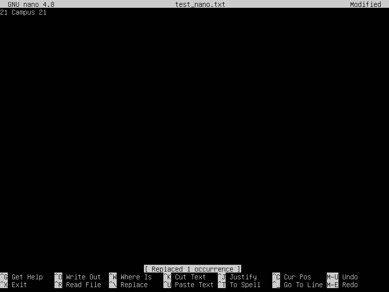
    - MCEDIT (поиск):
        
        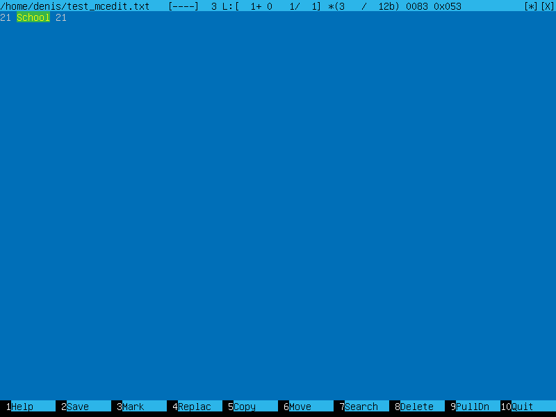
    - MCEDIT (замена):
        
        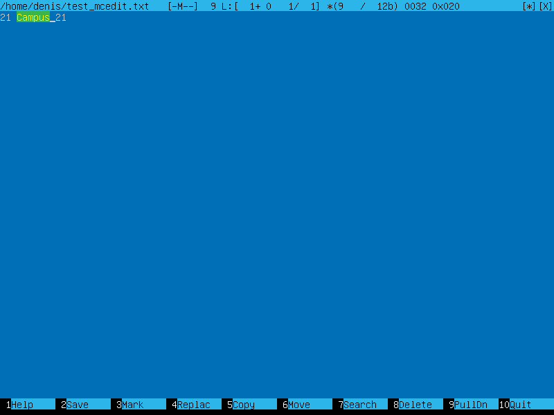

## Part 8. Установка и базовая настройка сервиса SSHD

- Установлен SSH-сервер (sshd):

  ```bash
  sudo apt update
  sudo apt install -y openssh-server
  ```

- Включён автозапуск службы при загрузке:
    ```bash
    sudo systemctl enable ssh
    ```

- Сервис SSHD перенастроен на порт 2022 (файл /etc/ssh/sshd_config, параметр Port 2022), затем выполнена проверка и перезапуск:

    ```bash
    sudo sshd -t
    sudo systemctl restart ssh
    ```

- Наличие процесса sshd показано с помощью ps:

    ```bash
    ps aux | grep 'sshd'
    ```

- Объяснение команды ps aux:
    - a — показать процессы всех пользователей, привязанные к терминалам;
	- u — вывод в пользовательском формате (USER, %CPU, %MEM и т.д.);
	- x — показать процессы без управляющего терминала (демоны).

- Скриншот: наличие процесса sshd:
    
    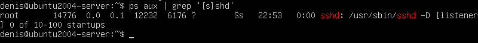

- Система перезагружена:

    ```bash
    sudo reboot
    ```

- Проверено, что SSHD слушает порт 2022 (при необходимости установлен netstat из пакета net-tools):
    ```bash
    sudo apt install -y net-tools
    sudo netstat -tan | grep 2022
    ```

- Объяснение ключей -tan в netstat:
	- t — только TCP;
	- a — все сокеты, включая LISTEN;
	- n — числовой вывод адресов/портов без DNS.

- Объяснение основных столбцов вывода netstat:
	- Proto — протокол;
	- Recv-Q/Send-Q — очереди приёма/отправки;
	- Local Address — локальный адрес и порт;
	- Foreign Address — удалённый адрес и порт;
	- State — состояние (для сервера важно LISTEN).

- Значение 0.0.0.0: прослушивание на всех IPv4-интерфейсах машины.

- Скриншот: netstat -tan (порт 2022 в состоянии LISTEN):
    
    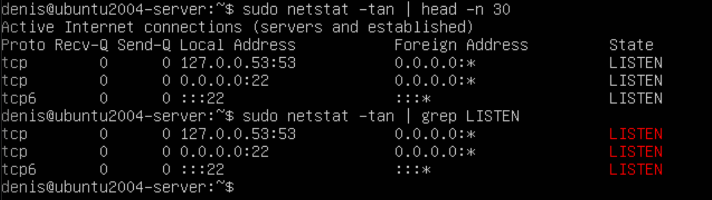

## Part 9. Установка и использование утилит top, htop

- Установлен htop:

  ```bash
  sudo apt update
  sudo apt install -y htop
  ```

- Запуск:
    ```bash
    top
    ```

- По выводу top определено:
    
    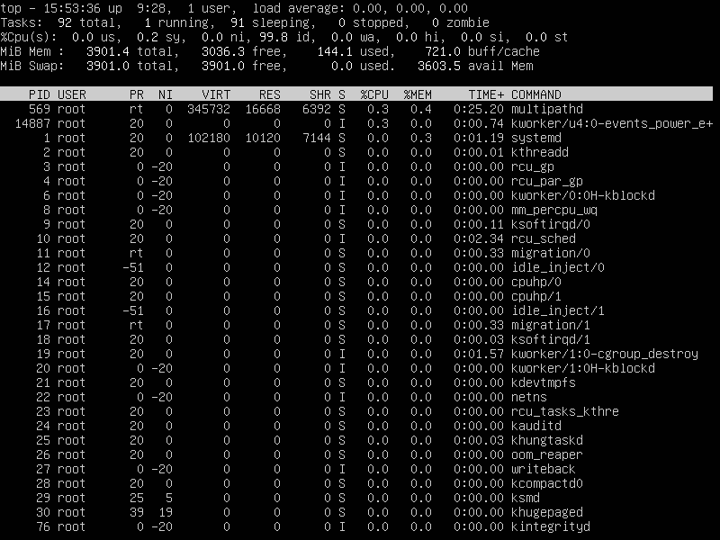

- Запуск:
    ```bash
    htop
    ```

- Скриншоты htop:
    - Отсортировано по PID:
    
        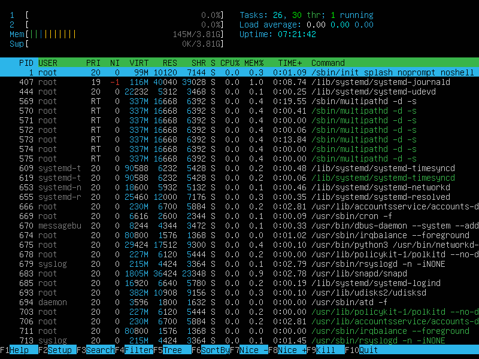

    - Отсортировано по PERCENT_CPU:
    
        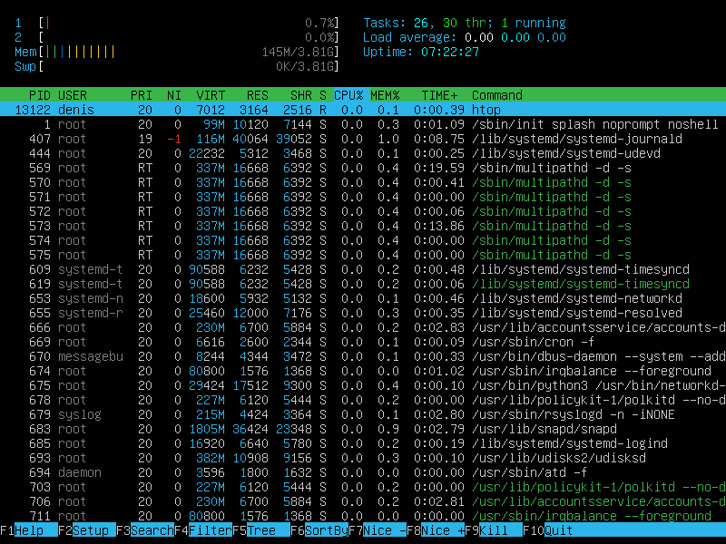

    - Отсортировано по PERCENT_MEM:
    
        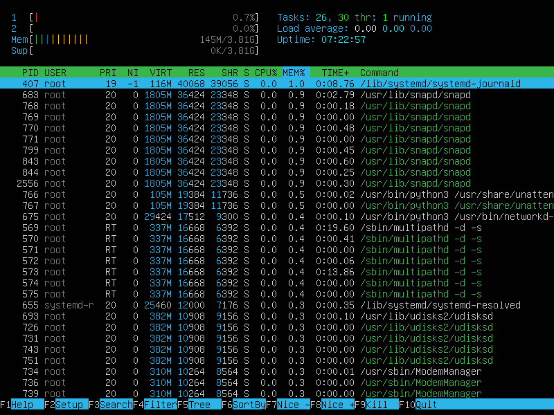

    - Отсортировано по TIME:
    
        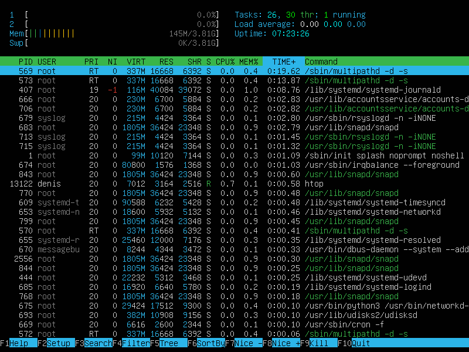

    - Фильтр по процессу sshd (F4 → sshd):
        
        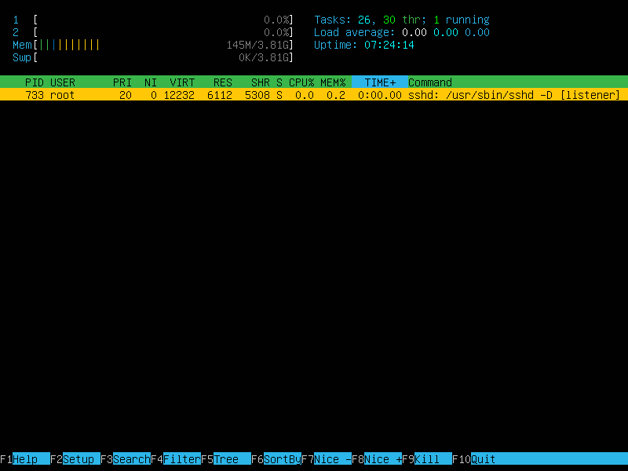

    - Найден процесс syslog (F3 → syslog):
    
        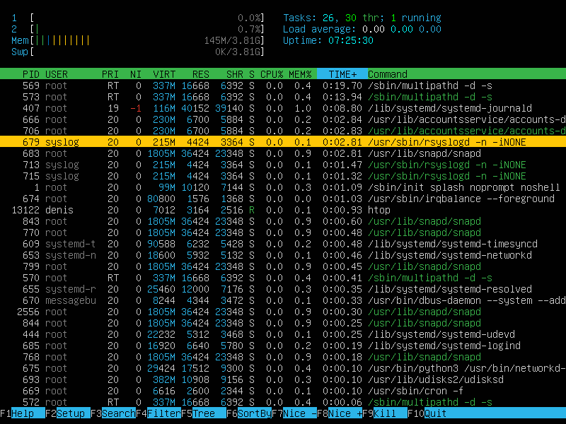

    - Добавлены meters: hostname, clock, uptime (F2 → Meters → добавить):
    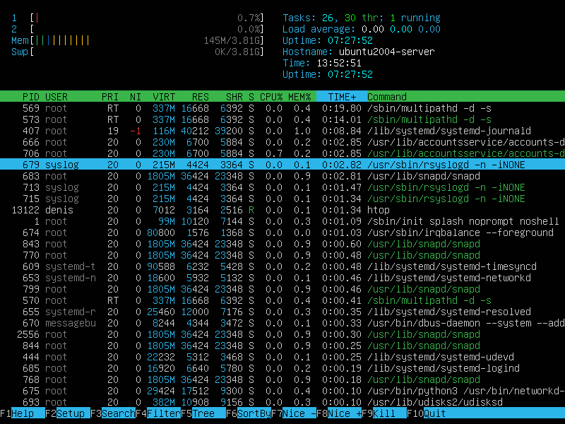


## Part 10. Использование утилиты fdisk

- Выполнена команда просмотра дисков и разделов:

  ```bash
  sudo fdisk -l
  ```

- Скриншот после выполнения команды
    
    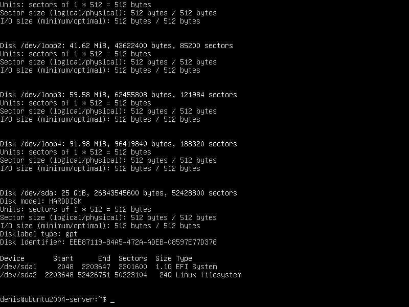

- Определение размера swap за счет команды
    ```bash
    swapon --show
    ```

- Скриншот: размер swap:
    
    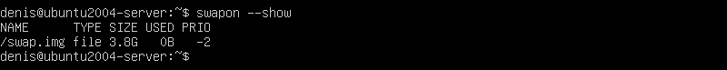

## Part 11. Использование утилиты df

- Выполнена команда `df`:
    
    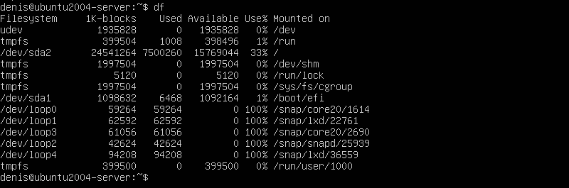

- Выполнена команда `df -Th`:
    
    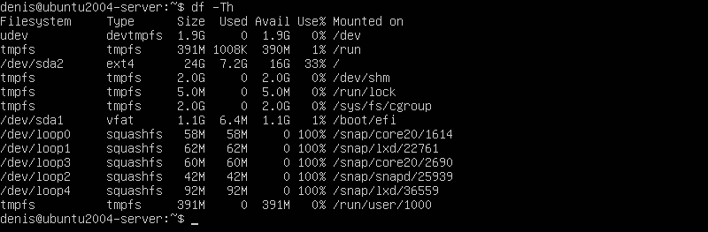

## Part 12. Использование утилиты du

- Команда `du`:
    
    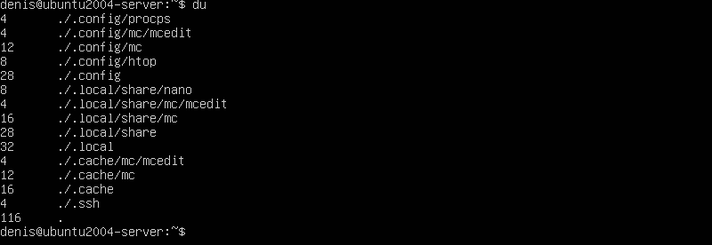

- Размер каталогов /home, /var, /var/log
    - В байтах:
    ```bash
    sudo du -sb /home /var /var/log
    ```

- Скриншот: размеры в байтах:
    
    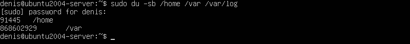

- В человекочитаемом виде:
    ```bash
    sudo du -sh /home /var /var/log
    ```

- Скриншот: размеры в человекочитаемом виде:


- Размер каждого элемента внутри /var/log
    ```bash
    sudo du -sh /var/log/*
    ```

- Скриншот: размеры элементов в /var/log:

    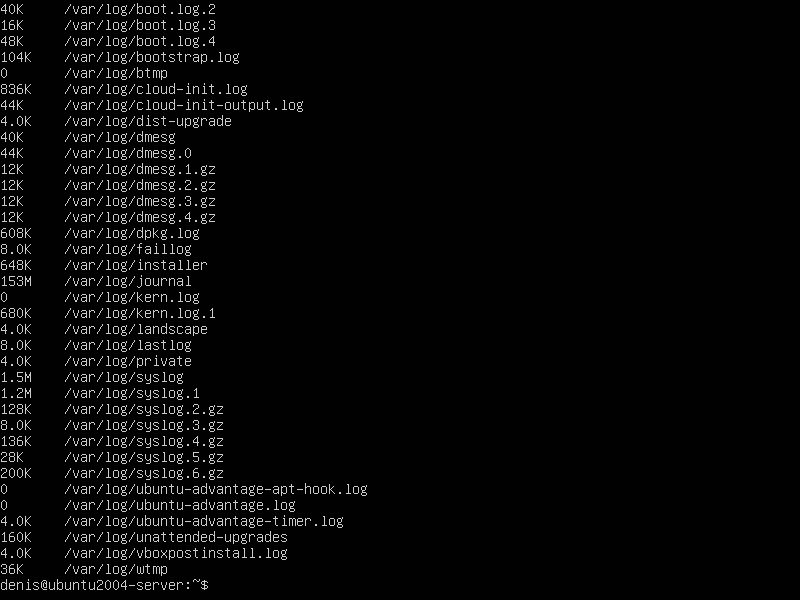

## Part 13. Установка и использование утилиты ncdu

- Установка ncdu

    ```bash
    sudo apt update
    sudo apt install -y ncdu
    ```

- Проверка размеров /home, /var, /var/log:
    - Размер /home:
        
        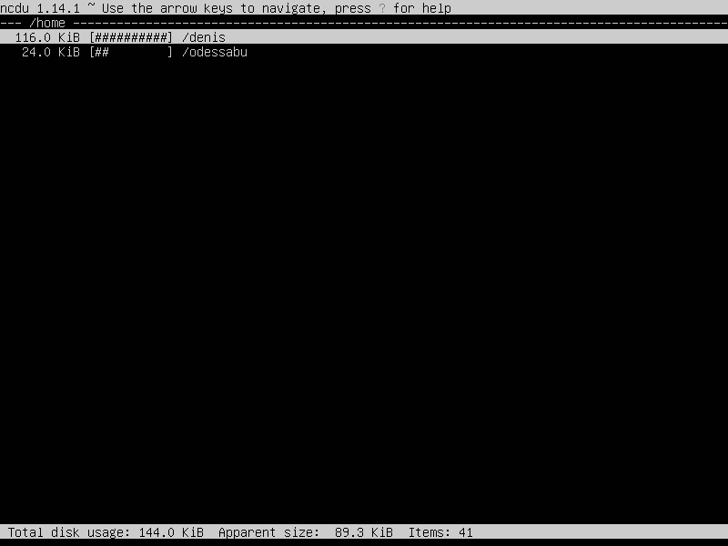

    - Размер /var:
        
        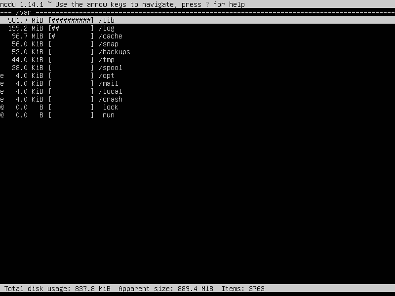

    - Размер /var/log:
        
        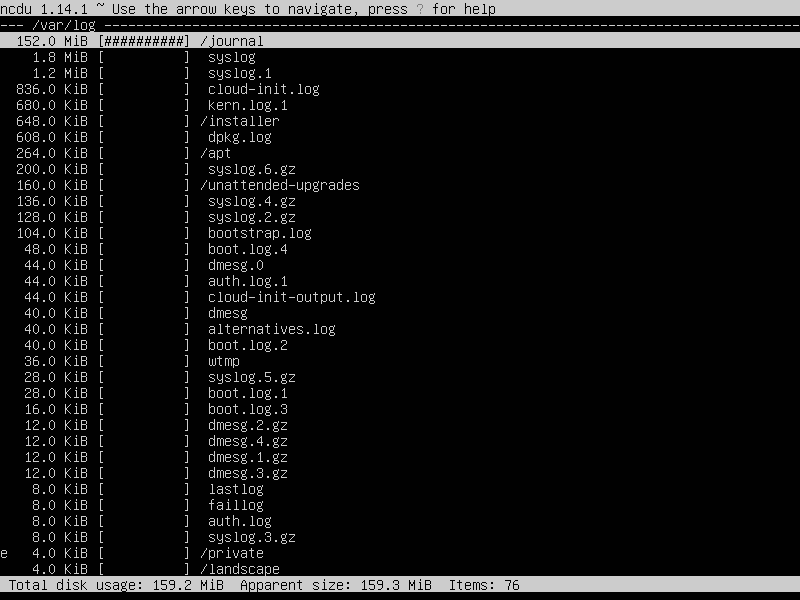

## Part 14. Работа с системными журналами

- Для просмотра логов использован `less`:

  ```bash
  sudo less /var/log/dmesg
  sudo less /var/log/syslog
  sudo less /var/log/auth.log

- Найдена последняя успешная авторизация в auth.log:
    ```bash
    sudo grep "Accepted" /var/log/auth.log | tail -n 1
    ```
        
        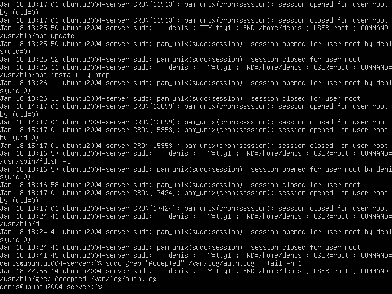

- Рестарт SSHd и поиск события в логах
    - Выполнен перезапуск службы SSH:
        ```bash
        sudo systemctl restart ssh
        ```
    - В syslog найдено сообщение о рестарте SSH:
        ```bash
        sudo grep -i "ssh" /var/log/syslog | tail -n 20
        ```
    
        
        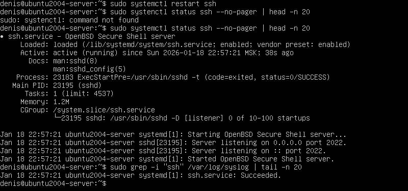

## Part 15. Использование планировщика заданий CRON

- Добавлена задача cron для запуска `uptime` каждые 2 минуты:

  ```bash
  crontab -e
  ```

- Строка в crontab: `*/2 * * * * /usr/bin/uptime`

- Список текущих задач cron:
    ```bash
    crontab -l
    ```

    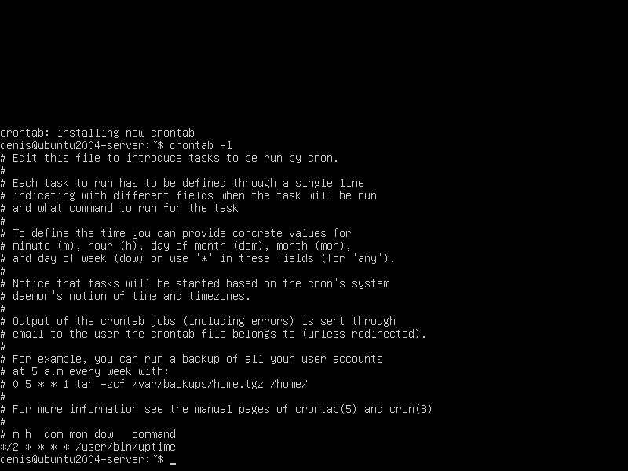

- Найдены строки о выполнении задачи в системных журналах:
    ```bash
    sudo grep -E "CRON.*uptime" /var/log/syslog | tail -n 20
    ```

    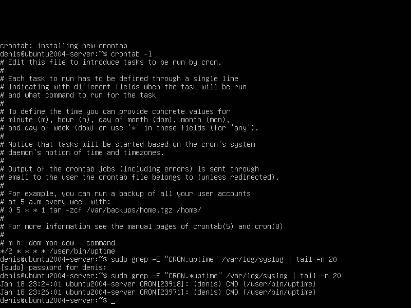

- Удалены все задачи из crontab:
- Проверка, что задач нет `crontab -l`:

    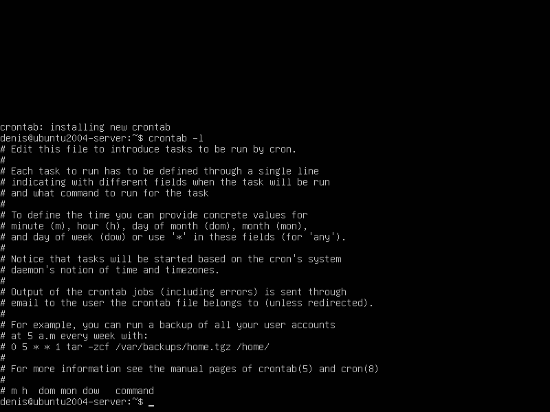